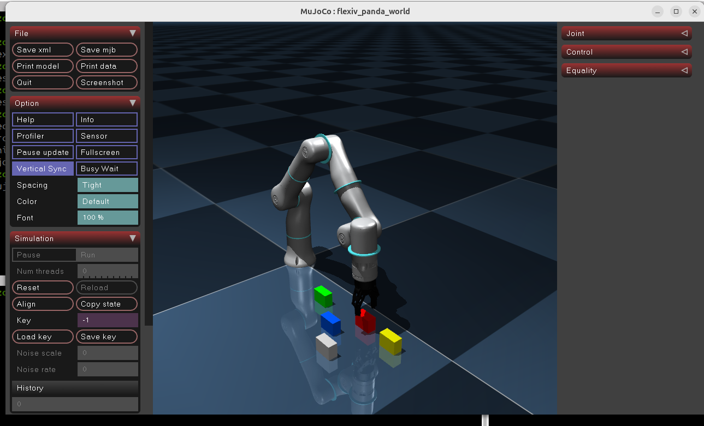

# Flexiv Rizon4s MuJoCo Data Collection

A lightweight MuJoCo framework for collecting robot manipulation demonstrations using the **Flexiv Rizon4s** robot.

<p align="center">
  
</p>

## Overview

This repository provides a simple demonstration collection pipeline for MuJoCo-based manipulation tasks.

Each collected demonstration contains:

- RGB observation
- Robot state
- Language instruction
- Delta action
- Task metadata
- Success label

The generated dataset can be used for Vision-Language-Action (VLA), Behavior Cloning, Diffusion Policy, ACT, and other imitation learning methods.

---

## Installation

### 1. Clone the repository

```bash
git clone https://github.com/Alchemist77/mujoco-vla-data-collection

cd flexiv-rizon4s-mujoco-data-collection
```

### 2. Create a virtual environment

```bash
python3 -m venv .venv

source .venv/bin/activate
```

### 3. Install dependencies

```bash
pip install --upgrade pip

pip install -r requirements.txt
```

---

## Run Data Collection

Viewer mode

```bash
python scripts/collect_mujoco_delta.py
```

Headless mode

```bash
python scripts/collect_mujoco_delta.py --headless
```

---

## Dataset

Each episode stores

- RGB image
- Robot state
- Delta action
- Language instruction
- Episode metadata

---

## Repository Structure

```
flexiv-rizon4s-mujoco-data-collection
│
├── envs/
├── scripts/
├── flexiv_rizon4s_world.xml
├── rizon_arm_with_gripper.xml
├── requirements.txt
└── README.md
```

---

## Citation

If you use this repository in your research, please cite it as:

```bibtex
@misc{kim2026flexivrizon4s,
  author = {Jaeseok Kim},
  title = {Flexiv Rizon4s MuJoCo Data Collection},
  year = {2026},
  howpublished = {\url{https://github.com/YOUR_NAME/flexiv-rizon4s-mujoco-data-collection}}
}
```

---

## License

This project is licensed under the MIT License. See the LICENSE file for details.
